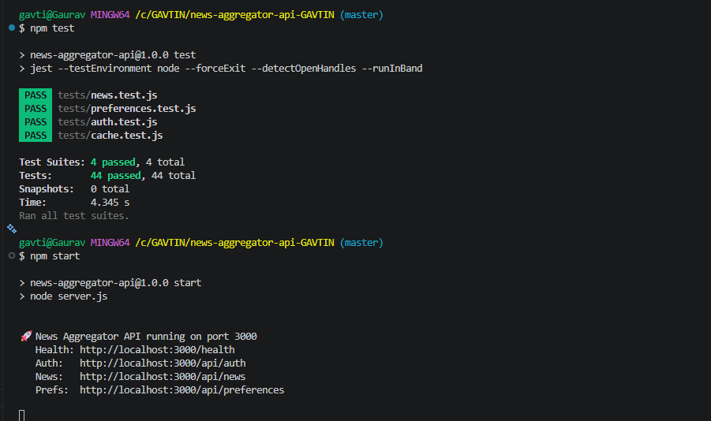

# 📰 News Aggregator API

A RESTful API for a **personalised news aggregator** built with Node.js, Express.js, bcrypt, and JWT. Users can register, set news preferences, search articles, save favourites, and track reading history — all backed by a real external news source (NewsAPI).

---

## Table of Contents

- [Features](#features)
- [Tech Stack](#tech-stack)
- [Project Structure](#project-structure)
- [Getting Started](#getting-started)
- [Environment Variables](#environment-variables)
- [API Reference](#api-reference)
- [Running Tests](#running-tests)
- [Caching Strategy](#caching-strategy)
- [Data Persistence](#data-persistence)
- [Error Handling](#error-handling)

---

## Features

- **JWT Authentication** — Secure register / login with bcrypt-hashed passwords
- **User Preferences** — Per-user news categories, sources, and language
- **Personalised Feed** — Top headlines fetched from NewsAPI based on preferences
- **Full-text Search** — Search across all news articles by keyword
- **Favourites** — Save and remove articles
- **Read History** — Track which articles a user has read
- **In-memory TTL Cache** — Reduces external API calls (configurable TTL)
- **Input Validation** — All routes validate inputs before processing
- **Global Error Handling** — Consistent JSON error responses

---

## Tech Stack

| Layer | Technology |
|---|---|
| Runtime | Node.js |
| Framework | Express.js |
| Auth | JSON Web Tokens (jsonwebtoken) |
| Password hashing | bcryptjs |
| HTTP client | Axios |
| Persistence | JSON flat-file (no DB required) |
| ID generation | uuid |
| Testing | Jest + Supertest |
| News source | [NewsAPI.org](https://newsapi.org) |

---

## Project Structure

```
news-aggregator-api/
├── server.js                    # Entry point — starts Express server
├── src/
│   ├── app.js                   # Express app, middleware, route mounting
│   ├── config/
│   │   └── index.js             # Centralised config (env vars, constants)
│   ├── controllers/
│   │   ├── authController.js    # Register & Login handlers
│   │   ├── newsController.js    # News feed, search, favourites, read history
│   │   └── preferenceController.js  # Get & update user preferences
│   ├── middleware/
│   │   ├── authMiddleware.js    # JWT verification middleware
│   │   ├── validateRequest.js   # Input validation middlewares
│   │   └── errorHandler.js      # Global error handler + 404 handler
│   ├── routes/
│   │   ├── authRoutes.js        # /api/auth/*
│   │   ├── newsRoutes.js        # /api/news/*
│   │   └── preferenceRoutes.js  # /api/preferences/*
│   └── services/
│       ├── cacheService.js      # In-memory TTL cache (singleton)
│       ├── newsService.js       # NewsAPI integration + article normalisation
│       └── userService.js       # JSON file-based user CRUD
├── data/                        # Auto-created; stores users.json at runtime
├── tests/
│   ├── auth.test.js
│   ├── cache.test.js
│   ├── news.test.js
│   └── preferences.test.js
├── .env.example
├── .gitignore
└── package.json
```

---

## Getting Started

### Prerequisites

- Node.js ≥ 18
- A free [NewsAPI key](https://newsapi.org/register)

### Installation

```bash
# 1. Clone the repository
git clone <your-repo-url>
cd news-aggregator-api

# 2. Install dependencies
npm install

# 3. Configure environment
cp .env.example .env
# Edit .env and add your NEWS_API_KEY and a strong JWT_SECRET

# 4. Start the server
npm start
# or for development with auto-reload:
npm run dev
```

The API will be available at `http://localhost:3000`.

---

## Environment Variables

| Variable | Description | Default |
|---|---|---|
| `PORT` | Server port | `3000` |
| `JWT_SECRET` | Secret key for signing JWTs | `news_agg_super_secret_dev_key_2024` |
| `JWT_EXPIRY` | Token expiry duration | `24h` |
| `NEWS_API_KEY` | Your NewsAPI.org key | _(required)_ |
| `CACHE_TTL` | Cache time-to-live in seconds | `300` |
| `DATA_DIR` | Directory for JSON data files | `./data` |
| `BCRYPT_ROUNDS` | bcrypt salt rounds | `10` |

---

## API Reference

All protected routes require the header:
```
Authorization: Bearer <token>
```

### Authentication

| Method | Endpoint | Auth | Description |
|---|---|---|---|
| POST | `/api/auth/register` | ❌ | Register a new user |
| POST | `/api/auth/login` | ❌ | Login and receive JWT |

**Register — Request Body**
```json
{
  "name": "Gaurav Sinha",
  "email": "gaurav@example.com",
  "password": "mySecret123"
}
```

**Login — Request Body**
```json
{
  "email": "gaurav@example.com",
  "password": "mySecret123"
}
```

**Success Response (both)**
```json
{
  "success": true,
  "data": {
    "user": { "id": "uuid", "name": "...", "email": "...", "preferences": {...} },
    "token": "eyJhbGci..."
  }
}
```

---

### News

| Method | Endpoint | Auth | Description |
|---|---|---|---|
| GET | `/api/news` | ✅ | Get personalised top headlines |
| GET | `/api/news/search?q=keyword` | ✅ | Search articles by keyword |
| GET | `/api/news/favorites` | ✅ | Get saved favourite articles |
| GET | `/api/news/read` | ✅ | Get read history |
| POST | `/api/news/:id/favorite` | ✅ | Add article to favourites |
| DELETE | `/api/news/:id/favorite` | ✅ | Remove article from favourites |
| POST | `/api/news/:id/read` | ✅ | Mark article as read |

**POST /:id/favorite and POST /:id/read — Request Body**
```json
{
  "article": {
    "title": "React 19 Released",
    "url": "https://example.com/react-19",
    "description": "...",
    "source": { "id": "techcrunch", "name": "TechCrunch" },
    "publishedAt": "2024-01-15T10:00:00Z"
  }
}
```

**Article shape returned by the API**
```json
{
  "id": "a3f9d12c1e8b",
  "title": "React 19 Released",
  "description": "...",
  "url": "https://...",
  "urlToImage": "https://...",
  "author": "Jane Doe",
  "source": { "id": "techcrunch", "name": "TechCrunch" },
  "publishedAt": "2024-01-15T10:00:00Z"
}
```

---

### Preferences

| Method | Endpoint | Auth | Description |
|---|---|---|---|
| GET | `/api/preferences` | ✅ | Get user preferences |
| PUT | `/api/preferences` | ✅ | Update user preferences |

**PUT /api/preferences — Request Body** _(all fields optional; partial updates supported)_
```json
{
  "categories": ["technology", "science"],
  "sources": ["bbc-news", "reuters"],
  "language": "en"
}
```

Valid categories: `business`, `entertainment`, `general`, `health`, `science`, `sports`, `technology`

---

## Running Tests

```bash
npm run test
```

Tests use **Jest** + **Supertest**. The news tests mock Axios so no real API calls are made. Each suite writes to its own isolated data directory which is cleaned up after the run.

---

## Caching Strategy

The `CacheService` is a simple in-memory TTL store (singleton Map). When a news endpoint is called:

1. A cache key is built from the request parameters.
2. If a valid (non-expired) entry exists → return it immediately.
3. Otherwise → call NewsAPI → store the result → return it.

The default TTL is **5 minutes** (configurable via `CACHE_TTL`). This dramatically reduces usage of the 100 req/day free tier.

---

## Data Persistence

User data is stored in `data/users.json` as a flat JSON array. Each user object contains:

```json
{
  "id": "uuid",
  "name": "...",
  "email": "...",
  "password": "<bcrypt hash>",
  "preferences": {
    "categories": ["general"],
    "sources": [],
    "language": "en"
  },
  "favorites": [],
  "readHistory": [],
  "createdAt": "2024-01-01T00:00:00.000Z"
}
```

---

## Error Handling

All errors return a consistent JSON shape:

```json
{
  "success": false,
  "message": "Human-readable error description."
}
```

| Status | Scenario |
|---|---|
| 400 | Validation failure (missing/invalid fields) |
| 401 | Missing, expired, or invalid JWT |
| 404 | Resource or route not found |
| 409 | Email already registered |
| 502 | External NewsAPI call failed |
| 500 | Unexpected server error |

# Test Results
